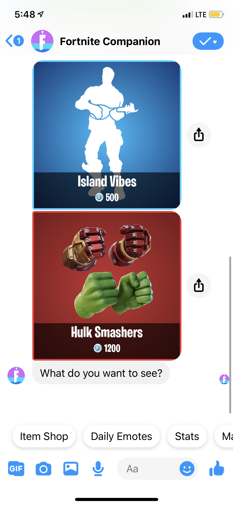
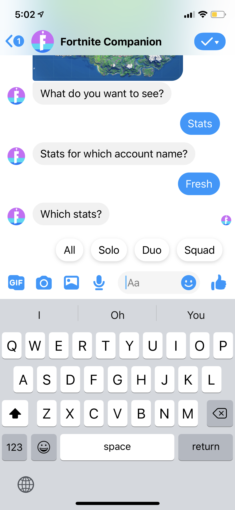
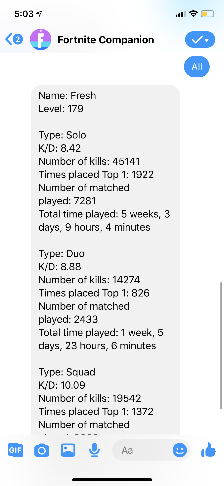
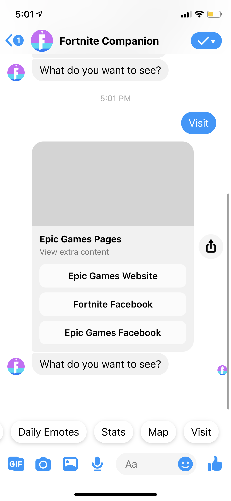

# What it Does

The Fortnite Companion is a Facebook Chat bot that can provide the user with Fortnite stats for a specific account, item shop details, map, and links to Epic Games all through the Facebook Messenger app. We wanted a quick way to view extra information on Fortnite while remaining in the Facebook Messenger app when we voice chat.

Tap the quick reply buttons to chat with the bot and grab quick info.

# How it was Built

We built the webhook server with Python and hosted it on Heroku. We used the https://fortniteapi.io/ API to retrieve the Fortnite data. We also made the Facebook Messenger API Bot with the help from the documentation of Messenger API.

# Screenshots

## Starting up the bot

## Pressing Item Shop

## Looking at the Map

## Fetching Stats

## View Links

# FortniteCompanion Setup

 
git clone git@github.com:carter144/FortniteCompanion.git
 
cd FortniteCompanion
 
./.venv/Scripts/activate OR Windows = ./.venv/Scripts/activate.bat
 
pip install -r requirements.txt (for required packages)
